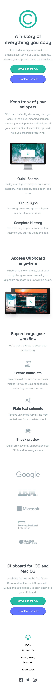

# Clipboard Landing Page

Essa é uma solução para o [Desafio: "Clipboard Landing Page" do Frontend Mentor](https://www.frontendmentor.io/challenges/clipboard-landing-page-5cc9bccd6c4c91111378ecb9). Os desafios que esse site oferece ajuda desenvolvedores a melhorar suas habilidades de código!

## O Desafio

Usuários devem poder ver:

- O layout ideal para o conteúdo dependendo do tamanho da tela do dispositivo
- Estados hover para todos os elementos interativos da página

## Aprendizado

- Pratiquei o uso da propriedade flex-wrap: wrap, otimizando, de forma mais simples, a responsividade do site

## Tecnologias Utilizadas

- HTML

- CSS

## Preview

### Desktop

### Active states

### Mobile

